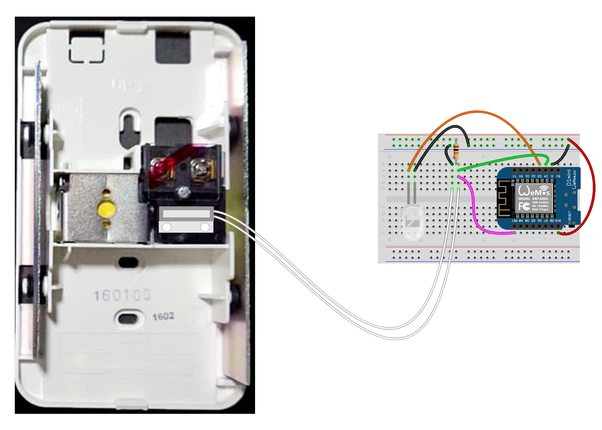

# Doorbell & Pushbullet integration
Why waste your money on an expensive premade Smart Doorbell while you already have a pre-existing old doorbell?

The purpose of this project is to repurpose your old doorbell and turn it smart.

## How it works
A lot of basic doorbell chimes uses solenoid.

Using a reed switch, we can harness that "magnet" when the doorbell is pressed.

Later we can do pretty much anything on the result, especially sending notification to your phone or any of your device connected to Pushbullet.

## Parts
* **WeMos D1 Mini**
* **Wemos D1 Mini Battery Shield** <i>(Optional, you can use **DC Buck Converter** to convert mains voltage (21V), my doorbell directly uses 220V and I don't want to mess with another transformer just yet)</i>
* If you use the battery shield, get any **Li-Po / Li-Ion 3.7V battery**, at least 900mAH is recommended
* Any reed switch, i use **MC-38**
* **10KΩ Resistor**
* **LED** <i>(Optional, for indicator)</i>

## Schematics
You can pretty much use any doorbell that has solenoid on it, and attach any kind of reed switch near it.

